# X11-in-Azure
 This process will allow you to easily use desktop/graphical applications in Azure Linux virtual machines.  Following this, you will stand up a windows server machine on the same vnet as your Linux machine, and use an X11 server running on your windows server.  I’ve used VcXsrv (https://sourceforge.net/projects/vcxsrv/), but XMing or mobaXterm would work well also.  Then you can use putty or mobaxterm to connect to the Linux machine, and use the X11 server directly.

Here are some instructions to get this set up with an "empty" Azure resource group.  If you already have a resource group, virtual network, etc. you can skip those steps.


## Create an Azure Resource Group
  Log into the Azure portal at http://portal,azure.com.  You should get a window that looks like this:
  . 

  Click the "+ New" button in the upper left:

  

  In the search box that pops up, type "resource group" and hit return.  

  

  Select the first choice in the results pane for "Resource group", and click the "create button".  
  Type a name for your resource group, and choose a location for the resource group, and click "create":

  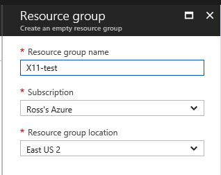

## Create an Azure Virtual Network

In the Azure portal, click "Resource Groups" 


In the blade that comes up, click on the resource group you created above.  This will bring up the resource group blade:

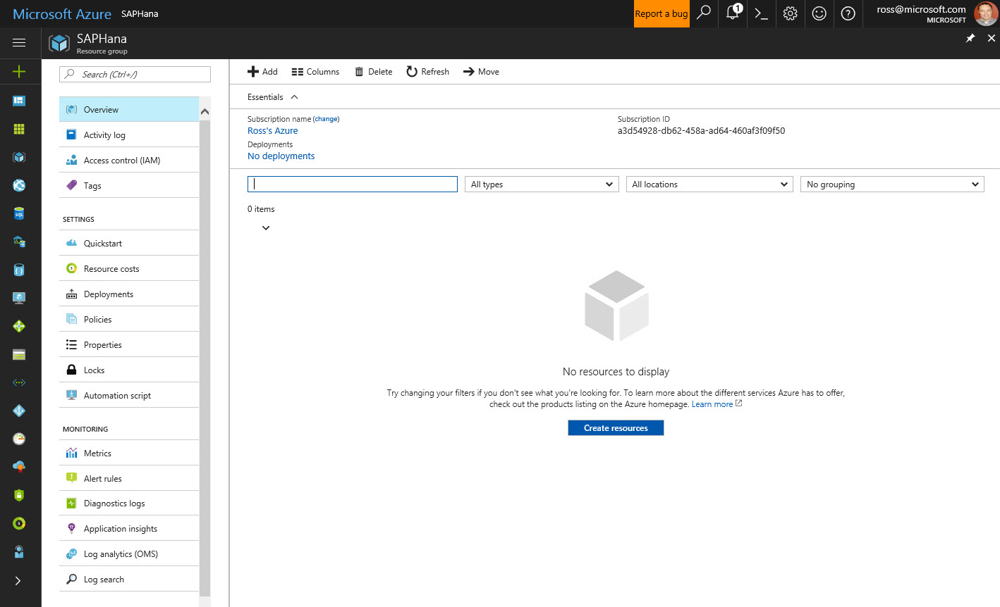

Click the "+ Add button":


Choose "virtual network" in the "everything" blade that comes up, and choose create.

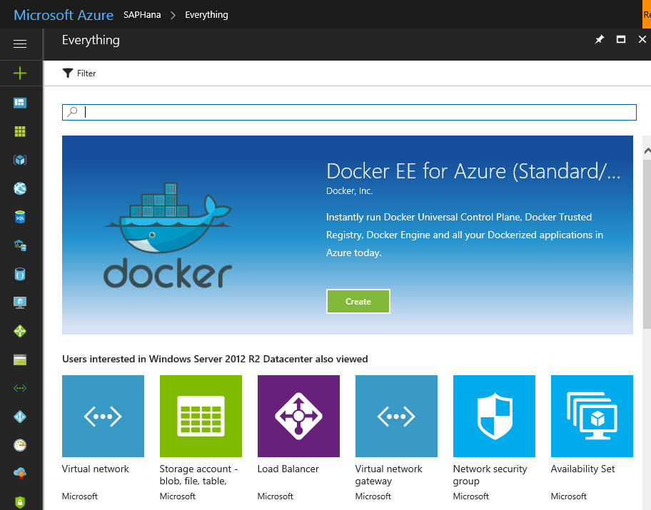

In the "Create virtual network blade, type a name for your virtual network, and verify the resource group and location are as you've planned, and click the create button:

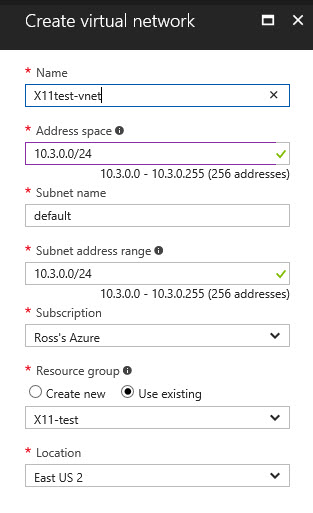

This will create the virtual network that your virtual machines will connect to.

## Create a Linux Virtual Machine

For this example, we will create an Ubuntu Linux virtual machine, but you can use whatever distribution of Linux you'd like.  To create your machine via the portal, go to the resource group blad and click "+ Add".  In the search box, type "ubuntu" and choose "Ubuntu Server 16.10":

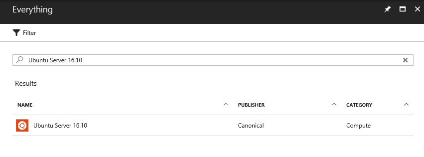

In the pane that comes up, choose "Create", and the following steps will configure your virtual machine.  Type the name of your virtual machine, choose the disk type, type a username and password, and choose OK:

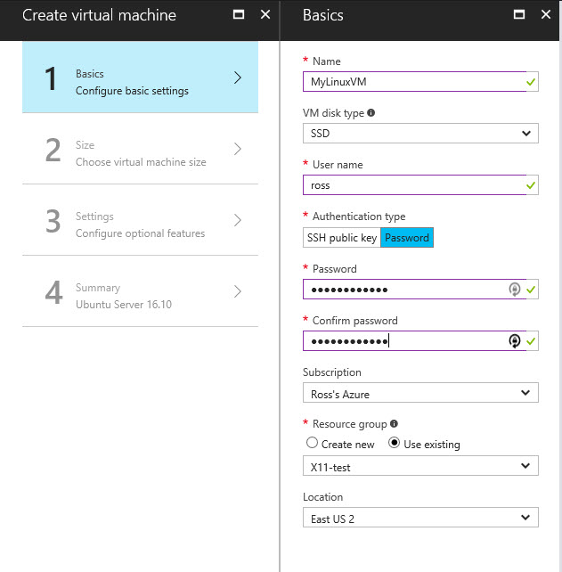

For the machine size, choose whatever you'd like.  We're going with the DS2_V2.  Finish the size selection by clicking "select".  In the settings box that comes up, verify that the Virtual Network name is the one you created earlier.  For these instructions, we are not going to have an Internet facing IP and Network Security group, so click on each of these:

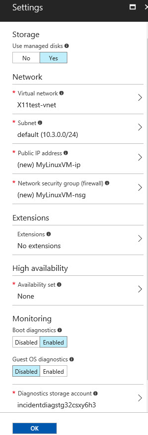

and choose "None":

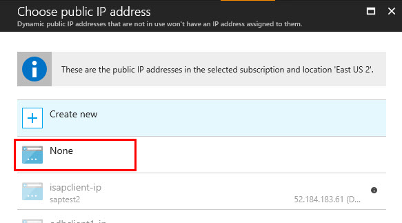

> If you do want your machine to have an Internet-facing address, leave these settings as their defaults, or create new configurations to fit your case.

Then click "OK" to complete the settings, and click "OK" after final validation.  When the server is created, navigate to the virtual machine blade and click on "Network Interfaces".  Make note of the *Private IP Address* for the virtual machine.

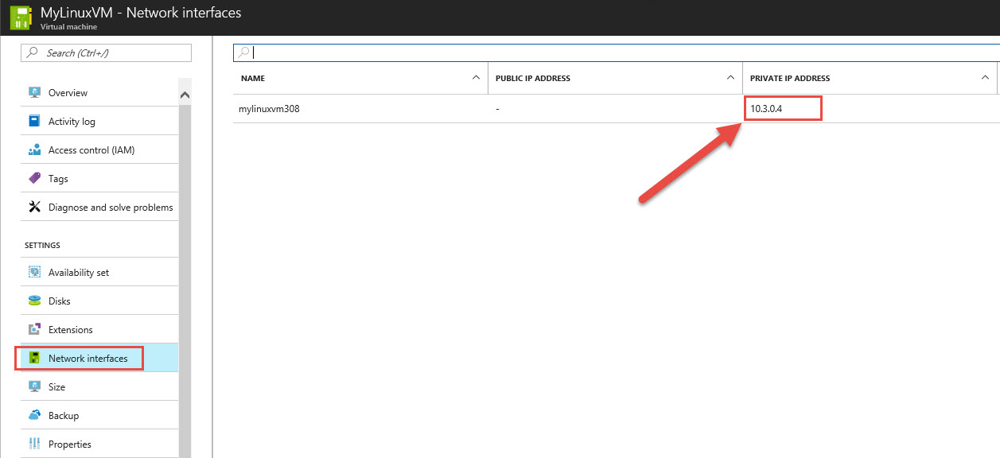

## Create an Azure client Virtual machine

We will create a Windows Server machine to access the other machines in our network.  To do this via the portal, go back to the resource group blade, and click "+ Add".  In the search box, type "windows server", and in the list that comes up, choose "Windows Server 2012 R2 Datacener":


In the pane that comes up, select "create".  This will take you to the "Create Virtual Machine" blade.  Here, you will configure all the options for your new virtual machine.  

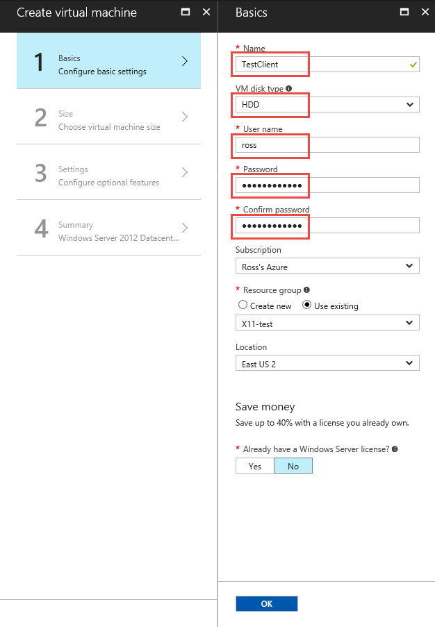

Type the name of your virtual machine, choose HDD for disk type, type a username and password, and choose OK. In the virtual machine size, you can choose the size you'd like.  We recommend the DS1_V2.  Finish the size selection by clicking "select".  In the Settings box that comes up, verify that the Virtual network name is the one you created earlier, and click "OK":

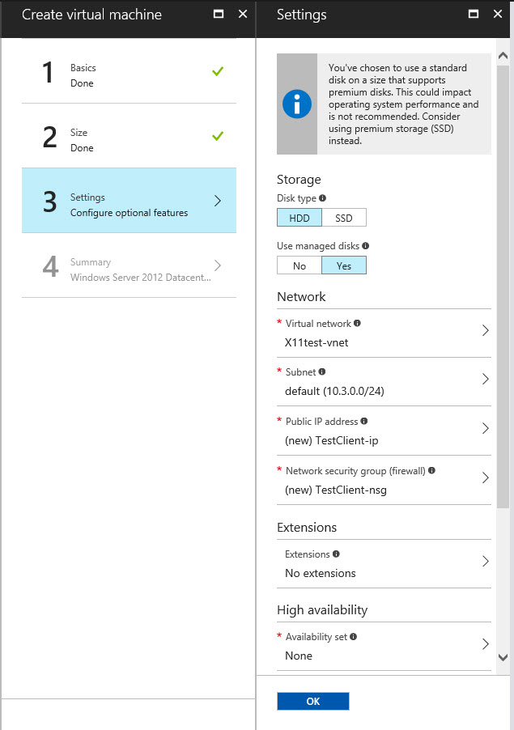

The Azure portal will then display and validate your options:

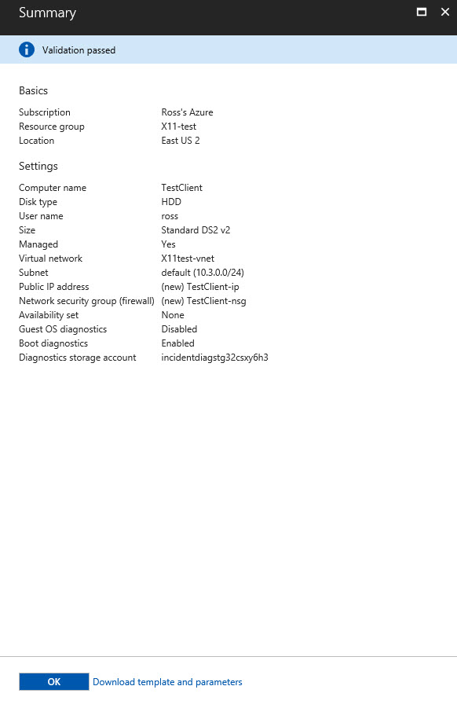

Click "OK", and the portal will create your virtual machine. This will typically take 3-5 minutes to complete.

# Install VcXsrv and putty on the client machine

After your virtual machines have been created, go to your resource group blade, and then click on your client virtual machine:

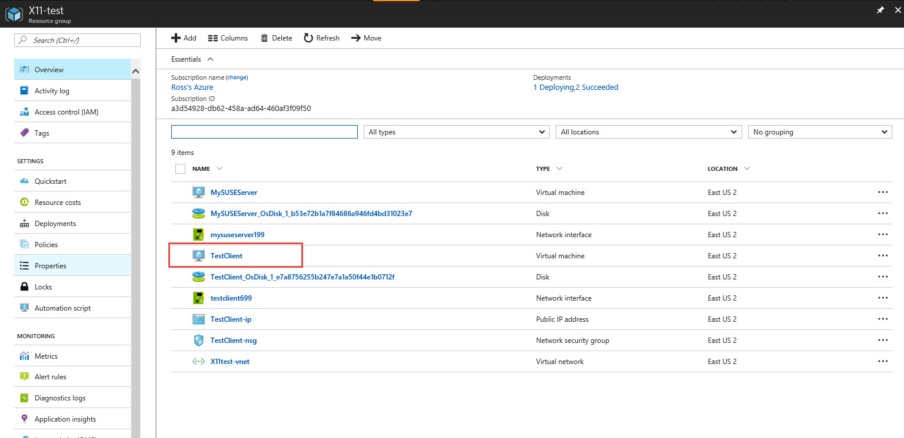

Click the "Connect" icon 

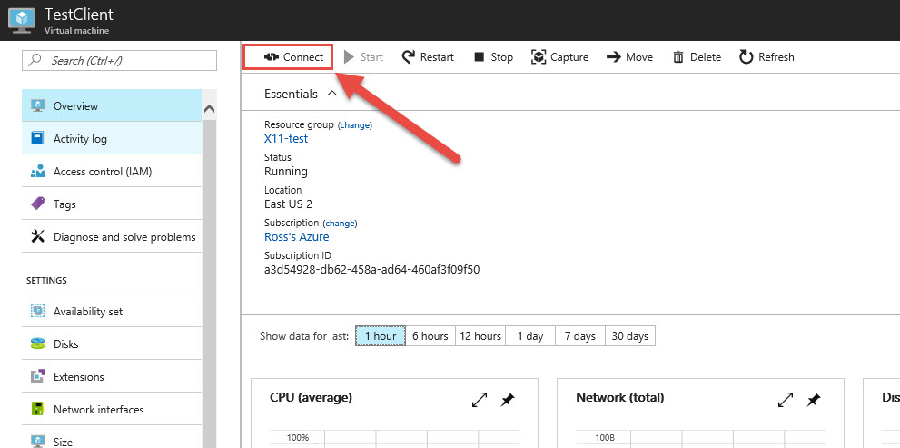

Click "open" to open the RDP file:


Enter your credentials to conneect to your Virtual Machine.  After the connection is established, there are two software packages that we need to download from the Internet - the VcXsrv X11 server, and the Putty ssh client.  Download and install Putty from `https://www.chiark.greenend.org.uk/~sgtatham/putty/latest.html`, choosing the 64-bit installer:


Download and install VcXsrv from `https://sourceforge.net/projects/vcxsrv/`.  


# Connect to your Linux machine and test

In your remote desktop session, run VxXsrv from the desktop icon or the windows start menu.  It will put an icon on your taskbar:


Run `putty`, and in the `PuTTY Configuration` dialog box, enter the IP address of your Linux machine, and give the session a name:

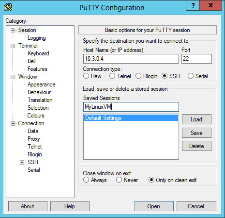 

Then click Connection/SSH/X11 in the category, and check the box to enable X11 Forwarding:

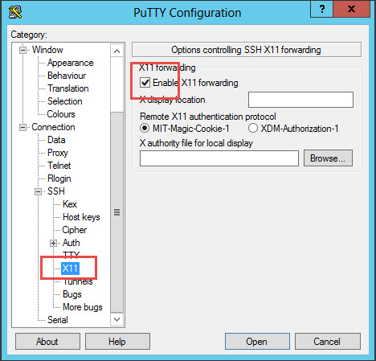

Click `Session` on the left window and click the `Save` button to save the session settings:

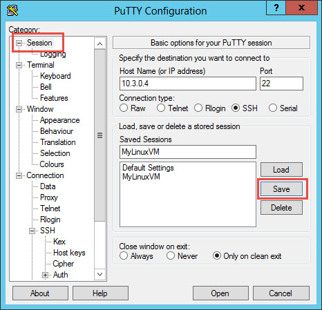

then click `Open`, accept the SSH certificate, and log in using the credentials you created for your Linux server.  To test a simple X11 application (xterm), install the software package using:
```bash
ross@MyLinuxVM:~$ sudo apt-get install xterm
```

and accept the installation of the indicated packages.  Then run xterm:

```bash
ross@MyLinuxVM:~$ xterm
```

This will put an icon on your taskbar:


click on this, and you should get an xterm window:

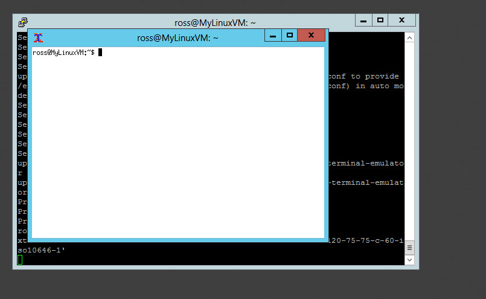

This shows that X11 applications are working.


Finally, this all works fine for the user you log in as, but if you need to run X11 when you sudo to root, you need to fix up the xauth profile for root.  To accomplish this, I use this in my root .bash_profile, obviously with your login user replacing "adminuser":

```bash
su - adminuser -c 'xauth list' |\
     grep `echo $DISPLAY |\
         cut -d ':' -f 2 |\
         cut -d '.' -f 1 |\
         sed -e s/^/:/`  |\
     xargs -n 3 xauth add
```
